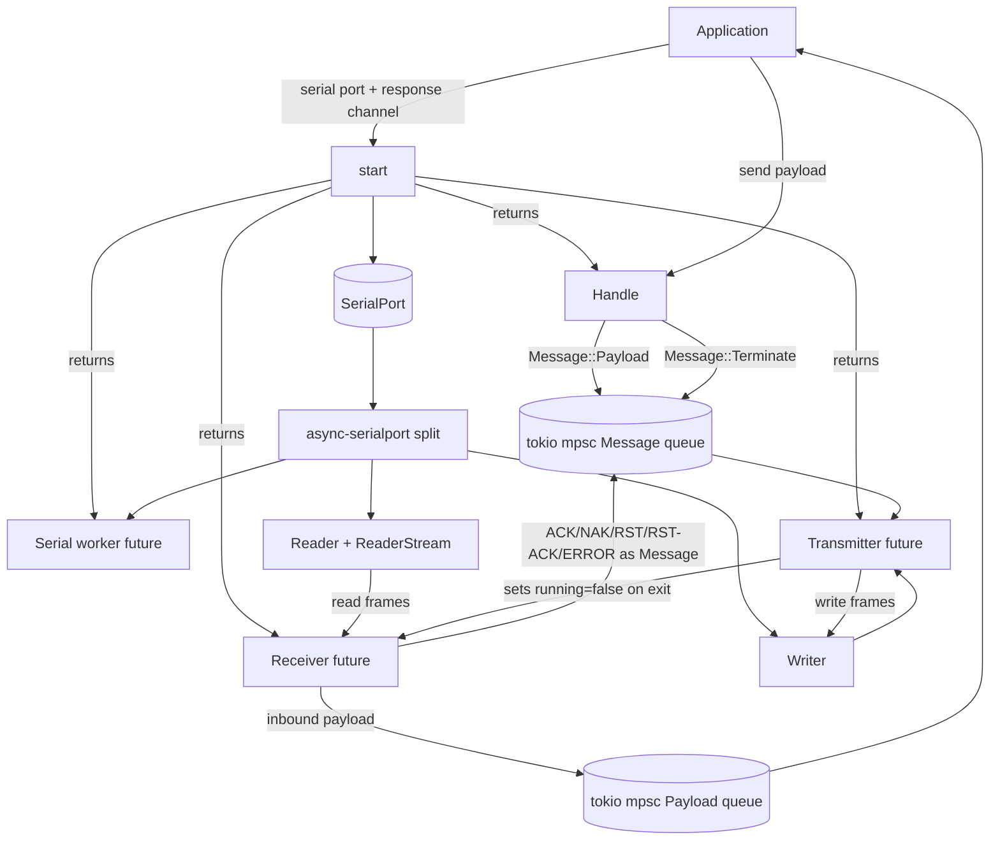
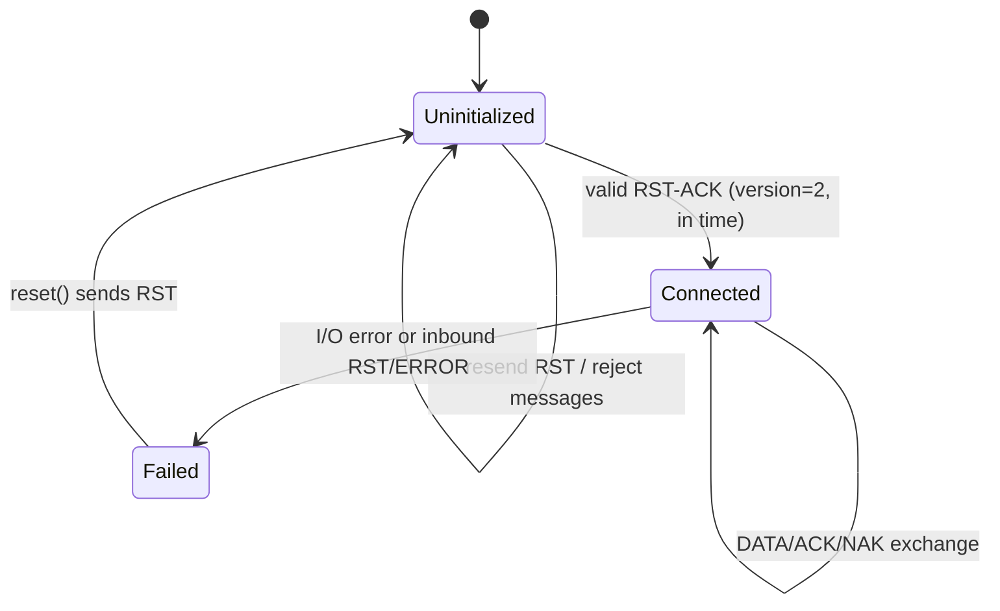
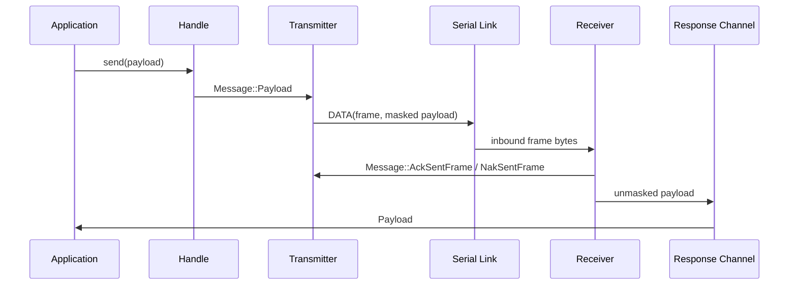
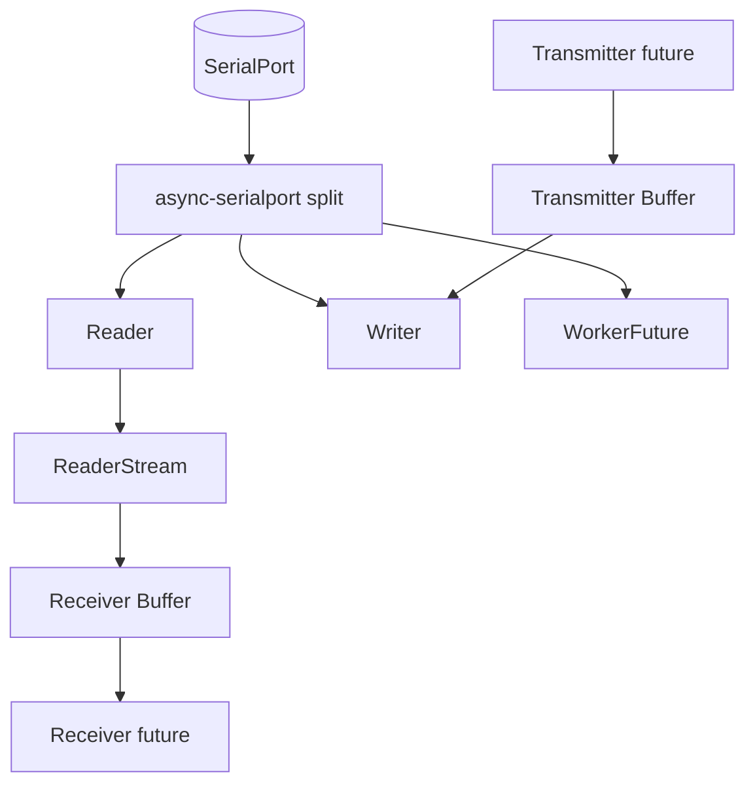

# ASHv2 Architecture

## Scope

This document describes the internal architecture of this crate as currently implemented.
The crate implements the host side of ASHv2 over a serial link to an NCP.

## High-Level Runtime Structure

At runtime, the crate is centered around `start(...)`, which creates two asynchronous
actor futures:

- `Transmitter`: owns serial writes and connection state.
- `Receiver`: owns serial reads and inbound frame handling.

`start(...)` splits the native serial port into an `async-serialport` reader, writer,
and worker future. It returns the worker, transmitter, and receiver futures, which the
caller must spawn or poll on their async runtime, and `Handle`, the user-facing send
handle. Incoming payloads are pushed to a user-provided response channel.

## Core Modules and Responsibilities

- `src/actor/*`
  - `start(...)`, internal message bus, future lifecycle, graceful termination signaling.
- `src/actor/receiver/buffer.rs`
  - Receive-side chunk buffering, byte scanning, control-byte handling, unstuffing, and frame parsing.
- `src/actor/transmitter/buffer.rs`
  - Transmit-side frame serialization, byte stuffing, frame termination, and serial writes.
- `src/frame/*`
  - Frame data structures and binary conversion for `DATA`, `ACK`, `NAK`, `RST`, `RST-ACK`, `ERROR`.
- `src/frame/headers/*`
  - Bit-level header composition/parsing for `DATA`, `ACK`, `NAK`.
- `src/protocol/randomization.rs`
  - ASH payload randomization (masking).
- `src/protocol/stuffing.rs`
  - Byte stuffing and unstuffing around control bytes.
- `src/validate.rs`
  - CRC-16-IBM-3740 validation.
- `src/seq.rs`
  - 3-bit sequence number type with modulo-8 wraparound.

## Connection and Task Lifecycle

The transmitter is the owner of connection state (`Uninitialized`, `Connected`, `Failed`).
On startup it sends `RST`, waits for `RST-ACK`, and only then handles payload traffic normally.

## Message Flow

### Outbound path (App -> NCP)

1. App calls `Handle::send(payload).await`.
2. `Handle` sends `Message::Payload` into the transmitter queue with a oneshot response channel.
3. Transmitter creates a `DATA` frame:
   - sets frame number (`Seq`, modulo 8),
   - sets current ACK number,
   - masks payload bytes,
   - computes CRC.
4. Transmitter writes via write buffer:
   - convert frame to bytes,
   - stuff reserved control bytes,
   - append `FLAG (0x7E)`,
   - write to serial port.
5. Transmitter stores transmission metadata for ACK/NAK-based completion/retransmission.

### Inbound path (NCP -> App)

1. `async-serialport` provides the receiver's async `Reader`.
2. `ReaderStream` provides chunks, and the receiver buffer retains any unconsumed bytes.
3. Receiver reads serial bytes until `FLAG`.
4. Receiver handles control bytes (`CANCEL`, `SUBSTITUTE`, `XON`, `XOFF`, `WAKE`) and un-stuffs payload bytes.
5. Parsed bytes are converted into a typed frame and CRC-validated.
6. Receiver behavior by frame type:
   - `DATA`: sequence check, send `ACK` or `NAK`, unmask payload, forward to response channel.
   - `ACK`: notify transmitter to retire sent frames up to ACK number.
   - `NAK`: notify transmitter to retransmit matching sent frame.
   - `RST`, `RST-ACK`, `ERROR`: forward to transmitter for connection-state handling.

## Async Serial I/O Path

The serial port is split by `async-serialport` into a `Reader`, a `Writer`, and a worker
future that yields the original serial port when the worker command channel closes. The
receiver side wraps the `Reader` in `ReaderStream` and stores the current chunk iterator
in the receive buffer, so bytes after a completed frame remain available for the next read.
The transmitter side writes fully encoded and stuffed frames through the async `Writer`.

## Shutdown Path

`Handle::terminate().await` asks the transmitter to terminate. When the transmitter exits
its main loop, it clears the shared running flag observed by the receiver. The caller owns
the returned futures and is responsible for joining or otherwise observing them on their
async runtime. The serial worker future resolves with the original serial port after the
reader and writer handles have been dropped. Termination failures are reported through the
crate's custom `Error` type, which wraps message-send failures.

## Frame Types and Purpose

| Frame | Header Pattern | Purpose | Key fields |
|---|---|---|---|
| `DATA` | bit7 = 0 | Carry protocol payload data | frame number (3 bits), retransmit flag, ACK number (3 bits), payload, CRC |
| `ACK` | `0b1000_xxxx` with type bits for ACK | Positive acknowledgement of received data | ACK number, `nRDY`, CRC |
| `NAK` | `0b1010_xxxx` with type bits for NAK | Negative acknowledgement, requests retransmit | ACK number, `nRDY`, CRC |
| `RST` | `0xC0` | Request reset / restart link establishment | fixed header, CRC |
| `RST-ACK` | `0xC1` | Confirm reset and report reset reason/version | protocol version, reset code, CRC |
| `ERROR` | `0xC2` | Signal protocol/link error | protocol version, error code, CRC |

### DATA header bit layout

- bits `6..4`: frame number (`Seq`)
- bit `3`: retransmit flag
- bits `2..0`: ACK number (`Seq`)

### ACK/NAK header bit layout

- ACK base: `0b1000_0000`
- NAK base: `0b1010_0000`
- bit `3`: `nRDY`
- bits `2..0`: ACK number (`Seq`)

## Reliability and Retransmission Model

- Sliding window capacity is `TX_K` (default `5`), stored in a fixed-capacity queue.
- Payload requests are requeued without delay when the sliding window is full.
- Payload sends fail with `ErrorKind::NotConnected` until the initial reset handshake completes.
- Each queued transmission tracks:
  - send time (`Instant`),
  - frame number,
  - retransmit count.
- On inbound `ACK`, matching transmitted frames are retired.
- On inbound `NAK`, matching frame is removed and retransmitted with retransmit flag set.
- Timed-out transmissions are dropped when processing ACK/NAK maintenance.
- After too many retransmissions (`ACK_TIMEOUTS = 4` in current code), transmit returns timeout error.

## CRC Validation

- CRC algorithm: `CRC-16-IBM-3740`.
- CRC is computed over frame bytes excluding the CRC field itself.
- Receiver validates CRC per frame type before semantic handling.
- Invalid CRC in inbound `DATA` triggers `NAK`; invalid control frames are ignored with warning logs.

## Randomization (Masking) in Detail

ASH payload randomization is implemented as XOR masking on payload bytes (not on headers/CRC):

- Generator state defaults:
  - seed: `0x42`
  - feedback mask: `0xB8`
  - flag bit: `0x01`
- For each generated mask byte:
  1. output current `random` value,
  2. shift `random` right by one,
  3. if previous output had flag bit set, XOR shifted value with `0xB8`.

Each payload byte is XORed with one generated mask byte.

Important properties:

- Symmetric transform: applying `mask()` twice restores original bytes.
- Used on send path before CRC computation for `DATA`.
- Used on receive path before delivering payload to the application.

## Byte Stuffing / Unstuffing in Detail

To preserve frame boundaries and control semantics on the serial stream, reserved bytes are escaped.

### Stuffing on transmit

Reserved bytes:

- `0x7D` (`ESCAPE`)
- `0x7E` (`FLAG`)
- `0x11` (`XON`)
- `0x13` (`XOFF`)
- `0x18` (`SUBSTITUTE`)
- `0x1A` (`CANCEL`)

For each reserved byte in frame content:

1. insert `ESCAPE (0x7D)` before it,
2. toggle bit 5 of original byte (`byte ^= 0x20`).

After stuffing all bytes, append final `FLAG (0x7E)` to terminate the frame.

### Unstuffing on receive

The receiver scans bytes until `FLAG`.

- On `ESCAPE`, it removes that byte and marks the next byte for de-escaping.
- The next byte is restored by toggling bit 5 (`byte ^= 0x20`).

Control-byte handling during stream parsing:

- `FLAG (0x7E)`: frame boundary.
- `CANCEL (0x1A)`: clear current buffer and error state.
- `SUBSTITUTE (0x18)`: set error condition; current frame is discarded on next `FLAG`.
- `XON/XOFF`: consumed as flow-control indications (not frame payload data).
- `WAKE (0xFF)`: treated as wake signal when buffer is empty.

## Configuration Knobs

Compile-time environment overridable constants:

- `ASHV2_MAX_PAYLOAD_SIZE` (default `128`)
- `ASHV2_T_RSTACK_MAX_MILLIS` (default `3200`)
- `ASHV2_TX_K` (default `5`)
- `ASHV2_T_RX_ACK_MAX_MILLIS` (default `3200`)

## CI and Quality Gates

GitHub Actions workflow (`.github/workflows/rust.yml`) runs:

- formatting check (`cargo +nightly fmt --check`)
- clippy with warnings denied
- tests (`cargo test --all-features`)
- release build (`cargo build --all-features --release`)
- `cargo vet` supply-chain checks
